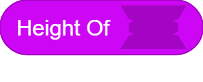
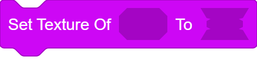

## Disclaimer: This Extension Must Run Unsandboxed
# Images
A [Penguinmod](https://studio.penguinmod.com/editor.html) Extension That Lets You Create/Manipulate Images For Visual Stuff Idk Man

Blocks:
- [Image Givers](#image-givers)
  - [`(Blank(X)x(Y)Image)`](#blankxxyimage---image)
  - [`(Open Canvas)`](#open-canvas---image)
- [Image Proportions](#image-proportions)
  - [`(Width Of (IMAGE))`](#width-ofimage---number)
  - [`(Height Of(IMAGE))`](#height-ofimage---number)
- [Data Urls](#data-urls)
  - [`(Data URL Of(IMAGE)`](#data-url-ofimage---string)
  - [`(From Data Url(URL))`](#from-data-urlurl---image)
- [Visual](#visual)
  - [`Set Texture Of [TARGET] To [IMAGE]`](#set-texture-oftexturetoimage---command)
  - [`(Get Texture Of[TARGET])`](#get-texture-of-targe---image)
  - [`Remove Texture Of[TARGET]`](#remove-texture-of-target---command)
  - [`(Get Image Of(COSTUME))`](#get-image-ofcostume--image)
- [Pixel Manipulation](#pixel-manipulation)
  - [`(Get Color Of Pixel(VECTOR)In(IMAGE))`](#set-texture-oftexturetoimage---command)

# Image Givers

## `(Blank(X)x(Y)image)` -> Image

Returns A Blank Image Of Width `(X)` And Height `(Y)`

## `(Open Canvas)` -> Image

Shows A Canvas That Returns Thet Painted Image In The Canvas

# Image Proportions

## `(Width Of(IMAGE))` -> Number

Gets The Width Of `(IMAGE)`

## `(Height Of(IMAGE))` -> Number

Gets The Height Of The `(IMAGE)`

# Data Urls

## `(Data URL Of(IMAGE))` -> String

Gets The `(IMAGE)` As A Data URL

## `(From Data URL(URL)) -> Image`

Makes A New Image From The `(URL)`

# Visual

## `Set Texture Of(TARGET)To(IMAGE)` -> Command

Sets The Texture Of `(TARGET)` to `(IMAGE)`

## `(Get Texture Of (TARGET))` -> Image

Gets The Texture Of `(TARGET)` That Can Be Set By `Set Texture Of` Block

## `Remove Texture Of(TARGET)` -> Command

Removes Any Textures Set To `(TARGET)`

## `(Get Image Of(COSTUME))` -> Image

Gets The `(COSTUME)` As A Image

# Pixel Manipulation

## `(Get Color Of Pixel(VECTOR)In(IMAGE))` -> String

Gets The Pixel On Location `(VECTOR)` In `(IMAGE)` (Top Left Is `(0,0)`)

## `(Set Color Of Pixel(VECTOR)Of(IMAGE)To(COLOR)) -> Image`

Creates A New Image Thats `(IMAGE)` But The Color At Pixel `(VECTOR)` Is Set To `(COLOR)` (Same Logic As Before)

