## Disclaimer: This Extension Must Run Unsandboxed
# Images
A [Penguinmod](https://studio.penguinmod.com/editor.html) Extension That Lets You Create/Manipulate Images For Visual Stuff Idk Man

Blocks:
- [Image Givers](#image-givers)
  - [`(Blank(X)x(Y)Image)`](#blankxxyimage---image)
  - [`(Open Canvas)`](#open-canvas---image)
- [Image Proportions](#image-proportions)
  - [`(Width Of (IMAGE))`](#width-ofimage---number)
  - [`(Height Of(IMAGE))`](#height-ofimage---number)
- [Data Urls](#data-urls)
  - [`(Data URL Of(IMAGE)`](#data-url-ofimage---string)
  - [`(From Data Url(URL))`](#from-data-urlurl---image)
- [Visual](#visual)
  - [`Set Texture Of [TARGET] To [IMAGE]`](#set-texture-oftexturetoimage---command)
  - [`(Get Texture Of[TARGET])`](#get-texture-of-targe---image)
  - [`Remove Texture Of[TARGET]`](#remove-texture-of-target---command)
  - [`(Get Image Of(COSTUME))`](#get-image-ofcostume--image)
  - [`(Is(TARGET)Using A Texture)`](#istargetusing-a-texture---boolean)
  - [`(Costumes Of(TARGET))`](#costumes-oftarget---array)
- [Pixel Manipulation](#pixel-manipulation)
  - [`(Get Color Of Pixel(VECTOR)In(IMAGE))`](#set-texture-oftexturetoimage---command)
  - [`(Set Color Of Pixel(VECTOR)Of(IMAGE)To(COLOR))`](#set-color-of-pixelvectorofimagetocolor---image)
  - [`(Get Average Pixel Of(IMAGE))`](#get-average-pixel-ofimage---string)
  - [`(Pixels Of (IMAGE))`](#pixels-ofimage---array)
  - [`(From Pixels(ARRAY))`](#from-pixelsarray---image)
- [Image Effects](#image-effects)
  - [`(Invert(IMAGE))`](#invertimage---image)
  - [`(Brighten(IMAGE)By(OFFSET))`](#brightenimagebyoffset---image)
  - [`(Rotate(IMAGE)By(ANGLE))`](#rotateimagebyangle---image)
  - [`(Scale(IMAGE)By(VECTOR))`](#scaleimagebyvector---image)
  - [`(Change Transparency Of(IMAGE)By(OFFSET))`](#change-transparency-ofimagebyoffset---image)
  - [`(Tint(IMAGE)Color(COLOR))`](#tintimsgecolorcolor---image)
  - [`(Crop(IMAGE)At(V1)(V2))`](#cropimageatv1v2---image)
  - [`(Horizontally Flip(IMAGE))`](#horizontally-flipimage---image)
  - [`(Vertically Flip(IMAGE))`](#vertically-flipimage---image)
- [Image Mixxing](#image-mixxing)
   - [`((A) HSV Mix (B))`](#a-hsv-mix-b---image)
   - [`((A) RGB Mix (B))`](#a-rgb-mix-b---image)

# Image Givers

## `(Blank(X)x(Y)image)` -> Image
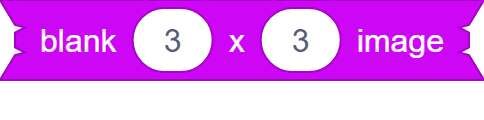

Returns A Blank Image Of Width `(X)` And Height `(Y)`

## `(Open Canvas)` -> Image

Shows A Canvas That Returns Thet Painted Image In The Canvas

# Image Proportions

## `(Width Of(IMAGE))` -> Number
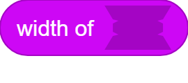

Gets The Width Of `(IMAGE)`

## `(Height Of(IMAGE))` -> Number
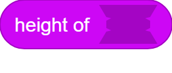

Gets The Height Of The `(IMAGE)`

# Data Urls

## `(Data URL Of(IMAGE))` -> String
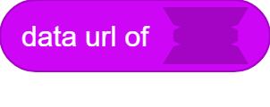

Gets The `(IMAGE)` As A Data URL

## `(From Data URL(URL)) -> Image`

Makes A New Image From The `(URL)`

# Visual

## `Set Texture Of(TARGET)To(IMAGE)` -> Command
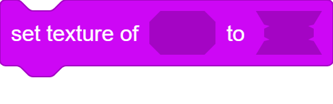

Sets The Texture Of `(TARGET)` to `(IMAGE)`

## `(Get Texture Of (TARGET))` -> Image

Gets The Texture Of `(TARGET)` That Can Be Set By `Set Texture Of` Block

## `Remove Texture Of(TARGET)` -> Command
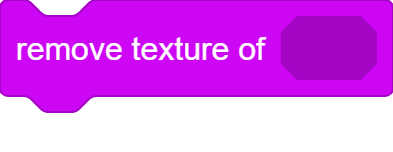

Removes Any Textures Set To `(TARGET)`

## `(Is(TARGET)Using A Texture)` -> Boolean
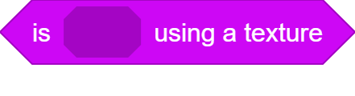

Checks If The Target `(TARGET)` Is Using A Texture Set by The `Set Texture Of` Block

## `(Costumes Of(TARGET))` -> Array
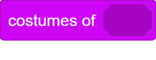

Returns A Array Of All Costumes Of `(TARGET)` As Images

## `(Get Image Of(COSTUME))` -> Image

Gets The `(COSTUME)` As A Image

# Pixel Manipulation

## `(Get Color Of Pixel(VECTOR)In(IMAGE))` -> String
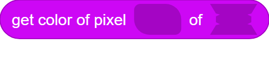

Gets The Pixel On Location `(VECTOR)` In `(IMAGE)` (Top Left Is `(1,1)`)

## `(Set Color Of Pixel(VECTOR)Of(IMAGE)To(COLOR))` -> Image
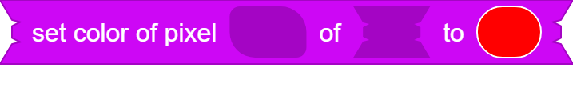

Creates A New Image Thats `(IMAGE)` But The Color At Pixel `(VECTOR)` Is Set To `(COLOR)` (Same Logic As Before)

## `(Get Average Pixel Of(IMAGE))` -> String
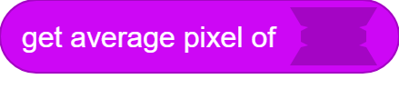

It Gets The Average Color Of `(IMAGE)` As A Hex Color

## `(Pixels Of(IMAGE))` -> Array

Gets An Array Of All The Pixels Of `(IMAGE)`

## `(From Pixels(ARRAY))` -> Image

Makes A New Image From Pixels `(ARRAY)`

# Image Effects

## `(Invert(IMAGE))` -> Image
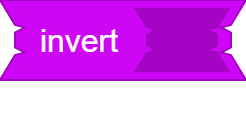

Inverts The Colors Of `(IMAGE)`

## `(Brighten(IMAGE)By(OFFSET))` -> Image
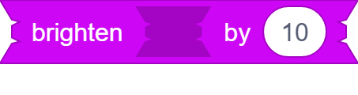

Brightens `(IMAGE)` By `(OFFSET)` That Goes From 0-255

## `(Rotate(IMAGE)By(ANGLE))` -> Image
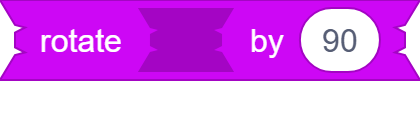

It Returns A Version Of ´(IMAGE)´ Rotated ´(ANGlE)´ Degreens In Radians

## `(Scale(IMAGE)By(VECTOR))` -> Image
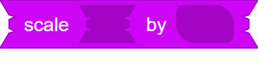

Scales `(IMAGE)` Horizontally By `(VECTOR)`'s x Axis And Vertically By `(VECTOR)`'s y Axis

## `(Change Transparency Of(IMAGE)By(OFFSET))` -> Image

Changes The Transparency Of `(IMAGE)` By `(OFFSET)` That Also Goes From 0-255

## `(Tint(IMAGE)Color(COLOR))` -> Image
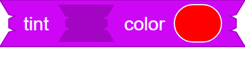

It Returns A Version Of `(IMAGE)` That's Just Has The Color `(COLOR)`

## `(Crop(IMAGE)At(V1)(V2))` -> Image
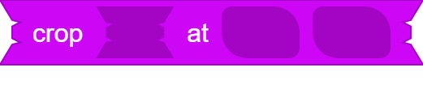

Crops `(IMAGE)` Were It Starts At `(V1)` And Ends At `(V2)` (Same Logic As In The Pixel Manipulation Blocks)

## `(Horizontally Flip(IMAGE))` -> Image

Returns A Version Of `(IMAGE)` Horizontally Flipped

## `(Vertically Flip(IMAGE))` -> Image

Returns A Version Of `(IMAGE)` Vertically Flipped

# Image Mixxing

## `((A) HSV Mix (B))` -> Image

Returns A Image Where It Gets All Pixels Of `(A)` And `(B)` And Gets The Average Of Their Hue, Saturation, And Value

## `((A) RGB Mix (B))` -> Image

Returns A Image Where It Gets All Pixels Of `(A)` And `(B)` And Gets The Average Of Their Red, Green, And Blue
